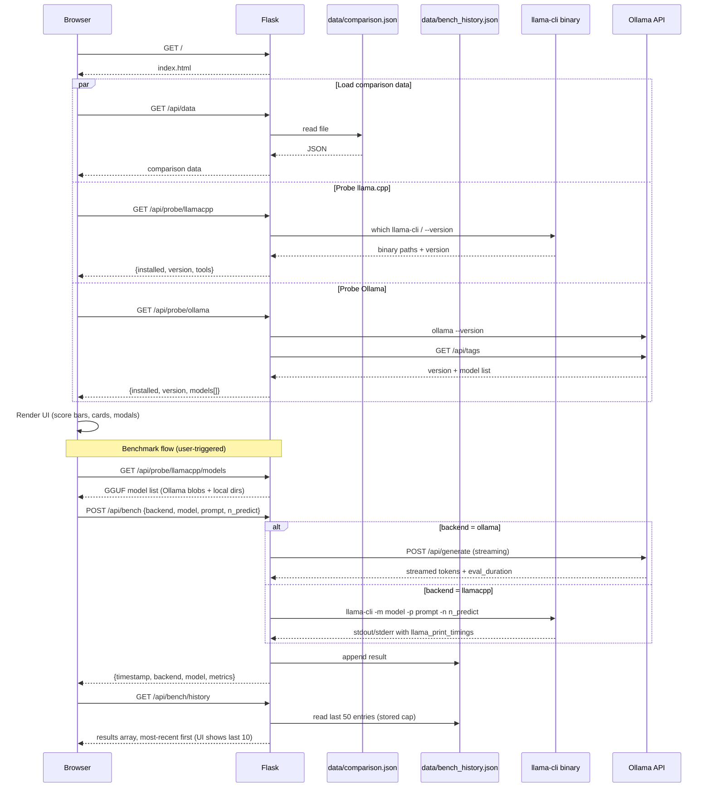

# Architecture

## System Overview

```mermaid
flowchart TD
    subgraph Browser["Browser — Single Page App"]
        direction TB
        A[index.html shell] --> B[app.js — vanilla JS]
        B --> C[Score overview]
        B --> D[10 category sections]
        B --> E[Verdict + Sources]
        B --> F[Live probe banner]
        B --> G[Benchmark runner]
    end

    subgraph Flask["Flask Backend — app.py"]
        H[GET /]
        I[GET /api/data]
        J[GET /api/probe/llamacpp]
        K[GET /api/probe/llamacpp/models]
        L[GET /api/probe/ollama]
        M[POST /api/bench]
        N[GET /api/bench/history]
    end

    subgraph Local["Local Machine"]
        O[(data/comparison.json)]
        P[(data/bench_history.json)]
        Q[llama-cli binary\nPATH / ~/.local/bin\n/opt/homebrew/bin / /usr/local/bin]
        R[Ollama daemon\nlocalhost:11434]
        S[GGUF files\n~/.ollama/blobs\n~/.cache/huggingface/hub\n~/Library/Caches/llama.cpp (macOS)\n~/.cache/llama.cpp (Linux)\n~/models, ~/Downloads]
    end

    Browser -->|HTTP| Flask
    H -->|render_template| Browser
    I -->|reads JSON| O
    J -->|subprocess which / --version + extra paths| Q
    K -->|walks filesystem (4 source types)| S
    L -->|subprocess ollama --version\nHTTP /api/tags| R
    M -->|subprocess llama-cli| Q
    M -->|HTTP streaming /api/generate| R
    M -->|reads/writes| P
    N -->|reads| P
```

## Data Flow



## Key Metrics Captured per Benchmark Run

| Metric | Ollama | llama-cli |
|---|---|---|
| `time_to_first_token_ms` | Wall clock to first non-empty chunk | `load_time + prompt_eval_time` |
| `tokens_per_second` | From `eval_duration` (daemon-reported) | From `llama_print_timings: eval time` |
| `eval_time_ms` | `eval_duration` converted from ns | `llama_print_timings: eval time` |
| `prompt_eval_time_ms` | `prompt_eval_duration` converted from ns | `llama_print_timings: prompt eval time` |
| `load_time_ms` | — | `llama_print_timings: load time` |
| `wall_time_ms` | `total_time_ms` | Measured by Python `time.monotonic()` |
