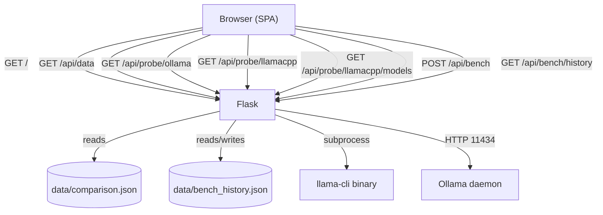

# llama.cpp vs Ollama — Visual Comparison App

A fully functional web application that visually compares **llama.cpp** and **Ollama** across 10 technical dimensions, with a live probe of locally installed versions and a built-in **benchmark runner** to measure real inference performance side-by-side.

## License

MIT — see [LICENSE](LICENSE)

---

## Architecture



---

## Features

- **10-category side-by-side comparison** — Architecture, Openness, Model Support, API, Hardware, Performance, Configuration, Deployment, Community, Limitations
- **Visual verdict badges** — Advantage / Neutral / Limited per tool per category
- **Expandable detail modals** — All evidence points for each cell, sourced and cited
- **Overall score summary** — Editorial scores with animated bar charts
- **Live local probe** — Detects installed llama.cpp binaries and Ollama version/models at runtime
- **GGUF model discovery** — Finds models from the Ollama blob store, HuggingFace Hub cache, llama.cpp download cache (`~/Library/Caches/llama.cpp` on macOS, `~/.cache/llama.cpp` on Linux), and common local directories (`~/models`, `~/Downloads`, etc.)
- **Benchmark runner** — Run timed inference on Ollama or llama-cli and compare tokens/second, TTFT, and eval times; results persist to `data/bench_history.json` (see [Benchmarking Feature — Technical Reference](Docs/Benchmarking.md))
- **Source panel** — All references with clickable links
- **Sticky column headers + sidebar scrollspy** — Easy navigation
- **Dark-mode, responsive design**

---

## Quick Start

### Prerequisites

- Python 3.9+
- `pip`
- Ollama installed (optional — app works without it, live probe will show "not found")
- llama.cpp installed (optional — app works without it, live probe will show "not found")

### 1 — Clone / enter directory

```bash
cd /path/to/llamacpp-vs-ollama
```

### 2 — Create `.env` from example

```bash
cp .env.example .env
# Edit PORT if 8088 is taken
```

Default `.env` values:

```
PORT=8088
DEBUG=false
# Maximum seconds to wait for a single benchmark run (increase for slow hardware or large models)
BENCH_TIMEOUT=120
```

> **macOS note:** Port 5000 is reserved by AirDrop. The `.env.example` default port is **8088**.
> If you skip the `.env` file and start manually, `app.py` falls back to port **8080**.

### 3 — Launch (single command, detached)

```bash
bash scripts/launch.sh
```

The URL is printed to the console:

```
✅  llama.cpp vs Ollama Comparison App is running!
➜   http://localhost:8088
```

### 4 — Stop

```bash
bash scripts/stop.sh
```

### Manual (foreground) start

```bash
python3 -m venv venv
source venv/bin/activate
pip install -r requirements.txt
python3 app.py
```

---

## Project Structure

```
llamacpp-vs-ollama/
├── app.py                  # Flask backend + live probe + benchmark endpoints
├── requirements.txt        # Python dependencies (flask, flask-cors, requests)
├── .env.example            # Environment variable template
├── data/
│   ├── comparison.json     # All comparison data (update independently of UI)
│   └── bench_history.json  # Benchmark run history (auto-generated)
├── templates/
│   └── index.html          # Single-page app shell
├── static/
│   ├── css/main.css        # Dark-mode stylesheet
│   └── js/app.js           # All UI logic (vanilla JS)
├── scripts/
│   ├── launch.sh           # Start app in detached mode
│   └── stop.sh             # Graceful shutdown
├── Docs/
│   ├── Architecture.md     # Mermaid architecture + data-flow diagrams
│   └── Quickstart.md       # Quick-start guide
└── output/                 # Runtime logs and PID file (git-ignored)
```

---

## API Endpoints

| Method | Path | Description |
|--------|------|-------------|
| `GET` | `/` | Main SPA |
| `GET` | `/api/data` | Full comparison JSON |
| `GET` | `/api/probe/llamacpp` | Live probe: llama.cpp binaries in PATH / `~/.local/bin` |
| `GET` | `/api/probe/llamacpp/models` | GGUF model discovery (Ollama blobs + HuggingFace cache + llama.cpp cache + local dirs) |
| `GET` | `/api/probe/ollama` | Live probe: Ollama version + installed models |
| `POST` | `/api/bench` | Run a benchmark (body: `backend`, `model`, `prompt`, `n_predict`) |
| `GET` | `/api/bench/history` | Last 50 benchmark results, most-recent first (UI displays last 10) |

### `/api/bench` request body

```json
{
  "backend":   "ollama",
  "model":     "llama3.2",
  "prompt":    "Explain backpropagation in one paragraph.",
  "n_predict": 128
}
```

For full parameter documentation, async job lifecycle, result interpretation, and sampling parameter analysis, see the [Benchmarking Feature — Technical Reference](Docs/Benchmarking.md).

---

## Updating Comparison Data

All comparison content lives in [`data/comparison.json`](data/comparison.json). The file is structured as:

- `meta.sources` — reference list
- `tools` — tool metadata
- `categories[]` — per-category comparison with `llamacpp` and `ollama` sides
- `verdict` — summary, use-case recommendations, openness verdict

Edit this file to update any data point without touching the UI code.

---

## Dependencies

| Package | Version | Purpose |
|---------|---------|---------|
| `flask` | ≥3.0.3 | Web framework |
| `flask-cors` | ≥4.0.1 | CORS headers for API |
| `requests` | ≥2.31.0 | Streaming HTTP calls to Ollama benchmark endpoint |

### Environment Variables

| Variable | Default | Purpose |
|----------|---------|---------|
| `PORT` | `8088` (`.env.example`), `8080` (app fallback) | HTTP port the app listens on |
| `DEBUG` | `false` | Enable Flask debug mode |
| `BENCH_TIMEOUT` | `120` | Max seconds to wait for a single benchmark run |

No external JS dependencies — all frontend code is vanilla JS.
